# [🙏] Running adb over WSL2

## TL:DR steps:

#### New method (adb.exe)
Just use `adb.exe` instead of `adb`. 

Make sure it's the exact same `adb.exe` that you'd normally be using in your Windows host.

#### Old method (adb in linux)
You've decided to use the linux version of `adb` in your WS(for)Linux2.

1. Ensure compatible / same versions of adb

2. Open any WSL2 instance to start the WSL machine

3. In Powershell (as Admin), perform the following:

  🔹 `Set-NetFirewallProfile -DisabledInterfaceAliases "vEthernet (WSL)"`

4. Open 2 terminals, one in Windows, the other in WSL2

5. On Windows, perform the following:

  🔹 `adb -a -P 5037 nodaemon server`

6. [*Optional*] On WSL, find IPv4 and verify connection

  `adb -H $(cat /etc/resolv.conf | awk '/nameserver/ {print $2}') -P 5037 devices`

7. On WSL, add the adb server socket:

  🔹 `export ADB_SERVER_SOCKET=tcp:$(cat /etc/resolv.conf | awk '/nameserver/ {print $2}'):5037`

  [*Optionally*]  append above to .bashrc

8. Done.

<!---  asdf --->
---
<!---  asdf --->

## Problem:
***Why does my device not show up in my WSL2 instance?***

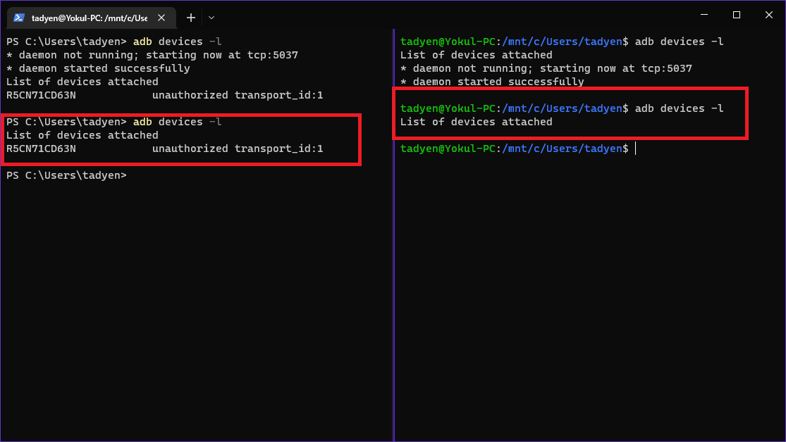

tags:
- wsl adb no usb devices
- wsl adb no devices/emulators found
- ADB device list empty using WSL2
- adb devices not visisble within windows subsystem(WSL)
- Unable to connect adb in wsl2 to windows adb server
- connection to WSL for Android device unstable

## Solution:
Simply run `> adb.exe` instead of `> adb` (if the path environment variable is set).

Otherwise cd to the dir containing `adb.exe` and run `> ./adb.exe`  

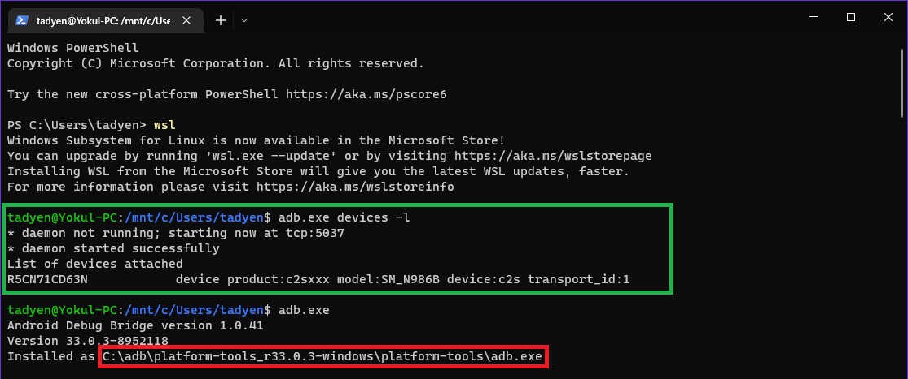

The wsl instance **inherits** the windows path environment variable.
For some reason, the Windows version ***works*** in WSL2 (Ubuntu-20.04) ?!?!
Why does this work? I've no idea. Does WSL2 allow running apps in its host Windows???

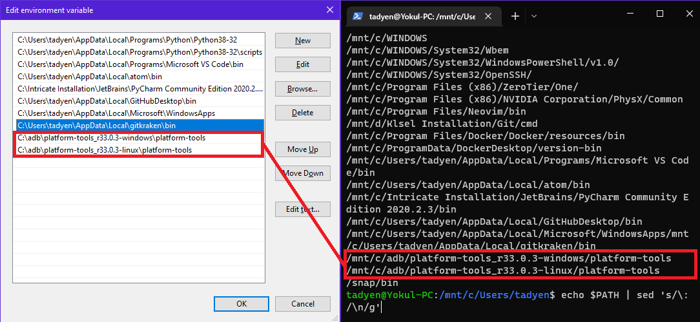

Highlighted below are:
- Red → shit no work, it's linux go figure
- Green → shit works
- Blue → same version omg! 

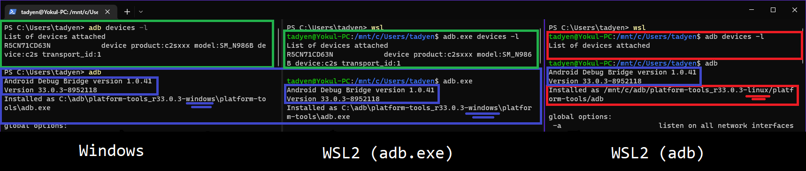

<!---  asdf --->
---
---
<!---  asdf --->
# DEPRECATED:
#### Old solution:
This is if you MUST run the linux version of adb on your wsl instance itself.

If the solution above didn't work, check that:
- You're using `> adb.exe` (windows) instead of `> adb` (linux)
- You do **not** need `adb` installed on your wsl machine. 

<!---  asdf --->
---
<!---  asdf --->
btw thanks: https://jaro.blog/blog/adb-in-wsl2.html

## 1. Obtain latest adb on both Windows and WSL2
#### Windows
https://developer.android.com/studio/releases/platform-tools

#### WSL2
Exactly like in Windows, download the zip, extract, and run it directly in your WSL2 instance.
Alternatively (Ubuntu... pacman in Arch, etc):
```
> sudo apt update
> sudo apt install adb
> sudo apt upgrade adb
```
you get the idea... just get adb in your wsl somehow idk

Check that your adb versions are the same. If you used a package manager, eg. apt or apt-get, the version could be different. This isn't *always* problematic but do avoid it to be safe.

##### Example: Different versions of adb

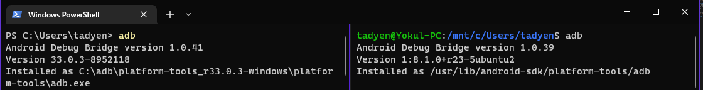

This was installed using `apt install adb`. Note the installation path on the right is  `/usr/lib/android-sdk/platform-tools/adb`.

##### Example: Same versions of adb

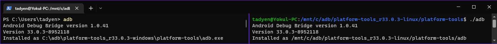

This was simply extracted from the `.zip` and run directly. Note the installation path on the right is the linux version.

## 2. Open any WSL2 instance
This is necesarry as skipping it makes the step below fail, and you have to redo it later.
This is because:
- If you don't start your wsl2 instance, there is no network interface for wsl2
- Without this network interface, the step below is pointless

## 3. Open powershell as Administrator. Remove the firewall for WSL2

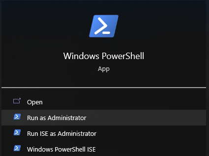

Ensure you run powershell as **Administrator** if you wish to avoid this:

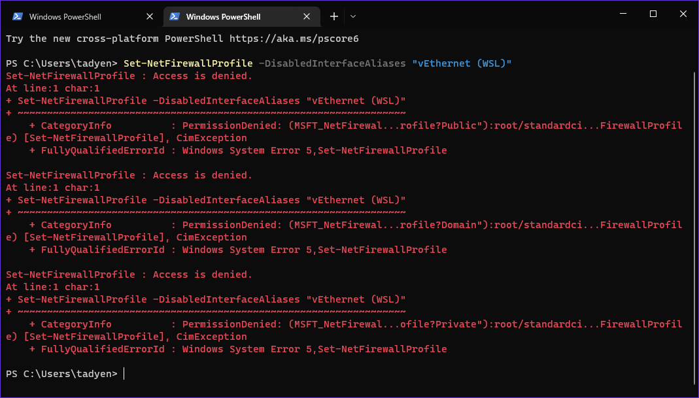

Run the following command (to remove firewall):

🔹  `Set-NetFirewallProfile -DisabledInterfaceAliases "vEthernet (WSL)"`

You will need to do this step ***everytime*** you reboot your windows system unless you script this.

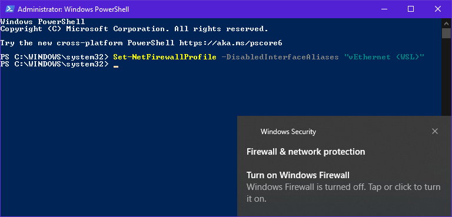

#### Optional - Running PS script on startup:
You could have a `.ps1` file with the command above set to run on startup. 
Simply create a shortcut to your `.ps1` file and place it in (replace `<YOUR_USER>`):

`C:\Users\<YOUR_USER>\AppData\Roaming\Microsoft\Windows\Start Menu\Programs\Startup`

You can also find this folder by `Win + R` and typing in `shell:startup`
Check in *task manager* to ensure that the above is Enabled on startup.

There are alternative ways to do this btw such as using *Task Scheduler*. 
## 4. Open 2 terminals, one in Windows, one in WSL2

I'm using **Windows Terminal** (from the Microsoft Store), but you can use vanilla **cmd**, it's up to you.
Terminal feels closer/similar to terminals in *NIX systems and looks much cleaner.

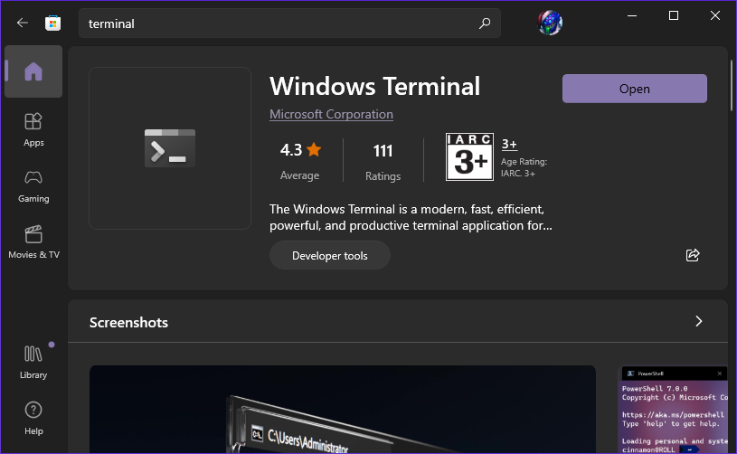

**Common hotkeys with Panes:**  
(your keybinds are visible under Command Pallette)

| Action | Hotkey |
| --- | - |
| **Close pane** | `Ctrl + Shift + W` |
| **Split pane, Down** | `Alt + Shift + -_` | 
| **Split pane, Right** | `Alt + Shift + =+` |

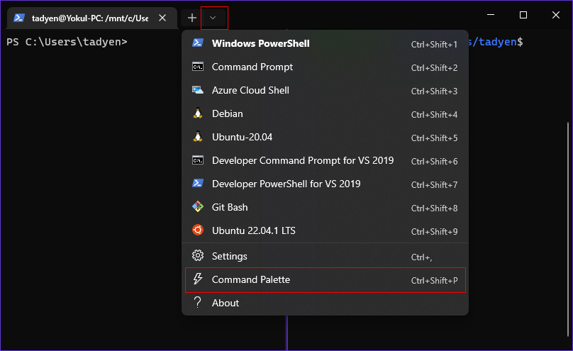

## 5. On Windows, perform the following command
🔹 `adb -a -P 5037 nodaemon server`


##### (Failure) If this happens:

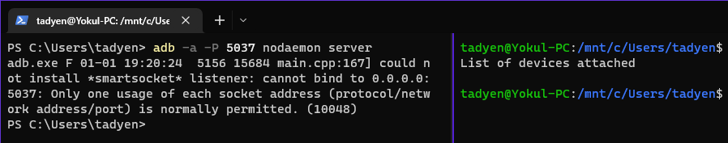

Then run the following on Windows side:

`adb kill-server`

Then re-attempt  the above.

## 6. [Optional] Find your WSL2 instance's IP 

On WSL2, the IP can be found in `/etc/resolv.conf` 
```
$ cat /etc/resolv.conf
# This file was automatically generated by WSL...
# [network]
# generateResolvConf = false
nameserver 172.30.96.1
```

You can also find the IP via `ipconfig` in windows

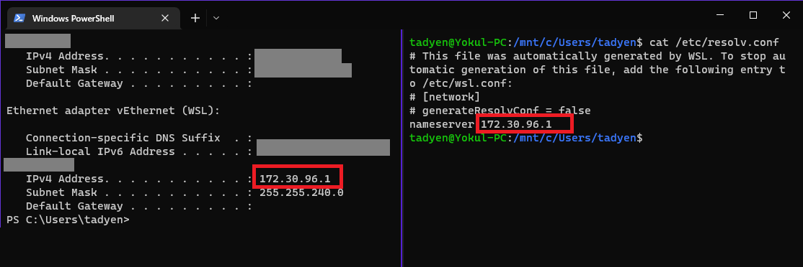

In the above, the IP is `172.30.96.1`

This IP changes everytime the WSL machine is restarted (ie each PC reboot or manual restart).

You can extract the IP itself by piping the above into `awk`:
```
$ echo $(cat /etc/resolv.conf | awk '/nameserver/ {print $2}')
172.30.96.1
```

To verify the above has worked, you can run the following:

`adb -H <YOUR.WSL2.IPv4.ADDR> -P 5037 devices`

or just copy paste this instead

`adb -H $(cat /etc/resolv.conf | awk '/nameserver/ {print $2}') -P 5037 devices`

and you should see your device connected:

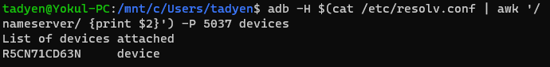

## 7. On WSL2, export the ADB_SERVER_SOCKET:
Replace the IPv4 in the following with your instance's IPv4.

`export ADB_SERVER_SOCKET=<YOUR.WSL2.IPv4.ADDR>`

Or use this instead:

🔹 `export ADB_SERVER_SOCKET=tcp:$(cat /etc/resolv.conf | awk '/nameserver/ {print $2}'):5037`

**VERY USEFUL OPTIONAL** - Add the above into `~/.bashrc` inside WSL2 environment to avoid repeating it on every WSL2 instance

*Where and what is inside .bashrc? Perform following:*
`cat ~/.bashrc` 

.bashrc is a shell script that runs on start-up in the *nix environment.

.bashrc chmod defaults on 644 (rw-r--r--). You would need to chmod 666 this file prior to editting it.

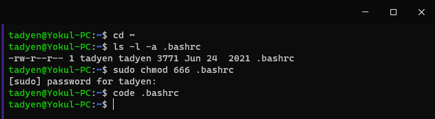

Add the line above inside .bashrc using your preferred editor

 **DO NOT** replace the file. Simply append to the end of .bashrc

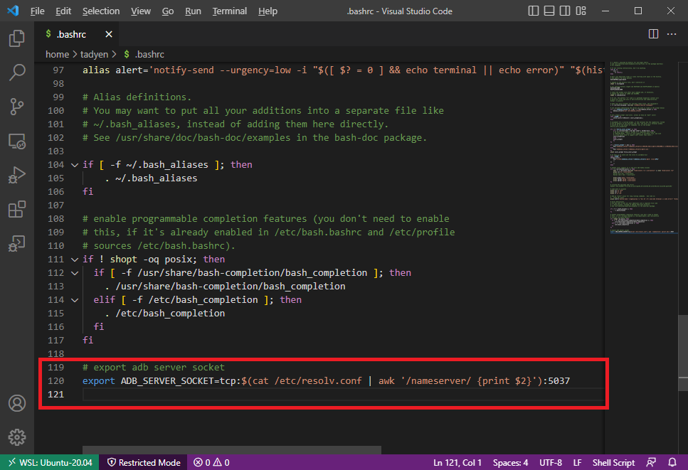

Verify that it has been saved using `cat ~/.bashrc` . Then chmod 644 it back.

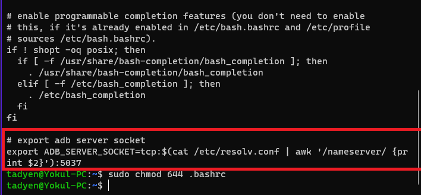


## 8. Run adb as usual. 

#### Hopefully it worked resulting in something like this:

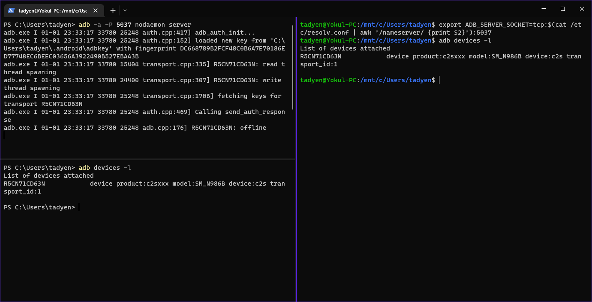

## DONE